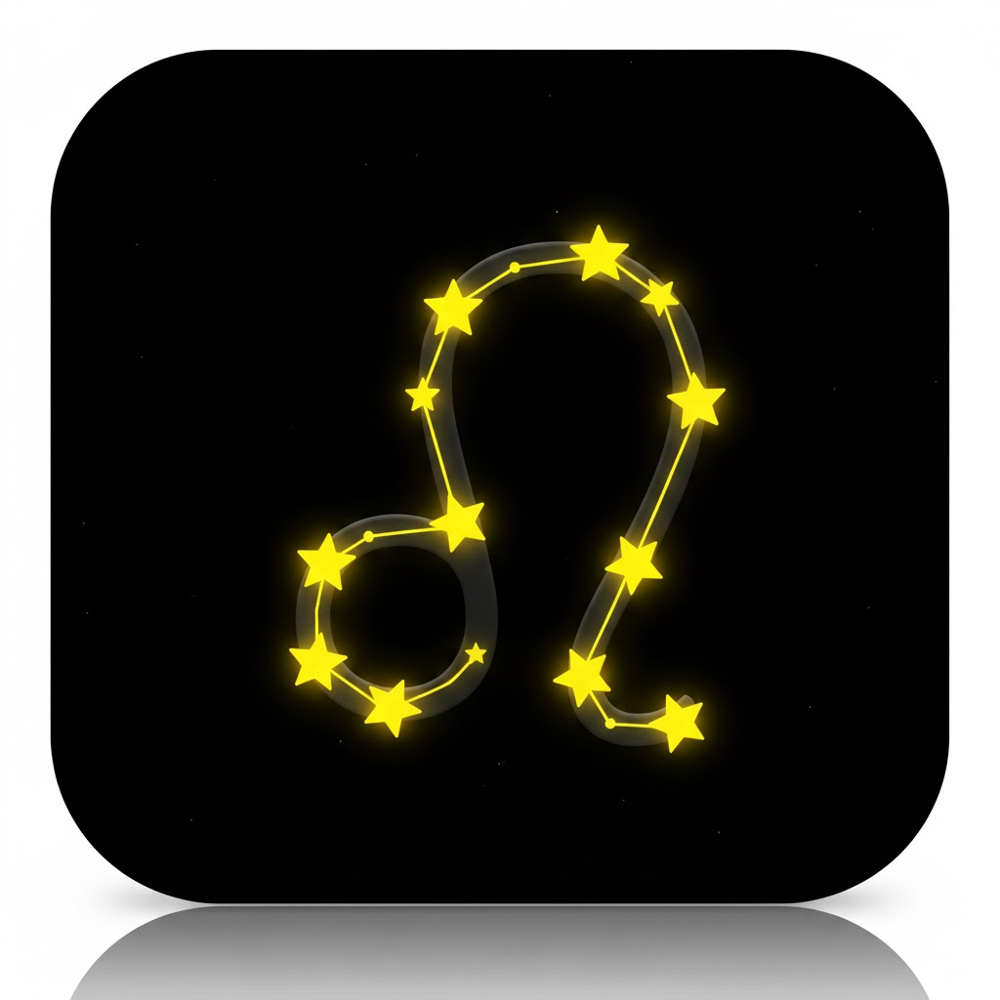

# 🦁 Lion OS (Chat Lion)

一个居住在你屏幕上的智能桌面助手。它不仅仅是一个聊天机器人，更是一个充满未来感的 HUD 风格生产力操作系统。



[English Docs](README.md) | [下载安装包](https://github.com/crazyjgg7/chat-lion/releases)

## ✨ 主要功能

### 🦁 桌面宠物 (核心)
- **常驻置顶**：一只可爱的 3D 风格狮子，随时待命。
- **点击交互**：点击狮子即可唤醒/隐藏 HUD侧边栏。
- **自由拖拽**：按住狮子依然可以拖动，侧边栏会自动跟随吸附。

### 🔮 HUD 侧边栏 (毛玻璃特效)
- **深色玻璃美学**：采用 macOS 原生 "Vibrancy" (HUD) 材质，质感拉满。
- **功能标签页**：
    - **⚡️ QUICK (快速短语)**：点击即复制常用语，支持右键管理。
    - **🧠 BRAIN (AI 指令)**：内置且可自定义 AI 提示词（翻译、代码分析、邮件撰写等）。
    - **📋 HISTORY (剪贴板)**：自动记录并管理你的剪贴板历史。
    - **💻 COMMAND (终端)**：内置迷你终端，执行系统命令。

### 🧠 AI 指令管理器 (新功能!)
- **管理你的 AI 资产**：可视化新增、编辑、删除 AI 提示词。
- **分类管理**：支持文本、链接、代码、邮件等分类。
- **独立窗口**：拥有与主程序一致的深色玻璃 UI。

## 📥 下载与安装

1.  访问 [GitHub Releases 页面](https://github.com/crazyjgg7/chat-lion/releases)。
2.  下载最新的 `.dmg` 安装包 (macOS)。
3.  将 Lion OS 拖入应用程序文件夹即可使用！

## 🛠 技术栈
- **核心**: Electron (Node.js)
- **前端**: React + Vite
- **样式**: Tailwind CSS + PostCSS
- **视觉**: Framer Motion + Native macOS Vibrancy (私有 API)

## ⌨️ 本地开发

```bash
# 安装依赖
npm install

# 启动开发模式 (热更新)
npm run dev

# 打包构建 (macOS)
npm run build
```

## 📄 开源协议
MIT
